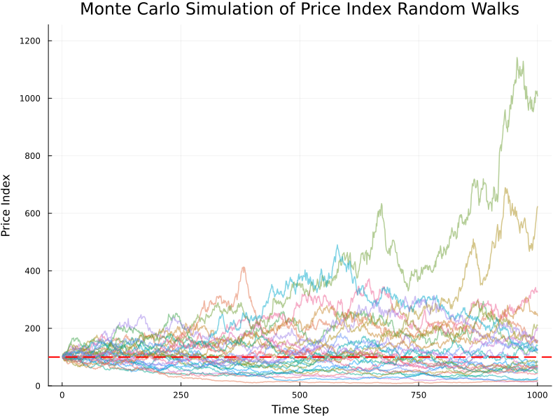
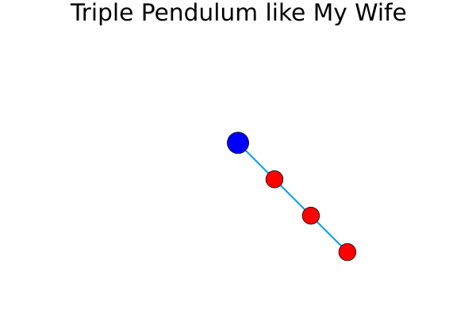
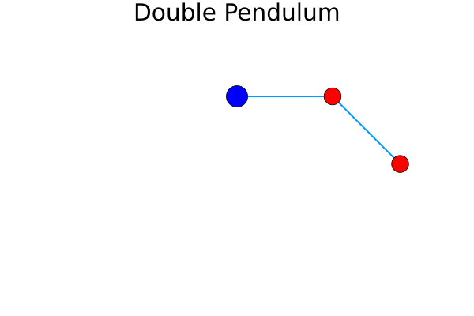
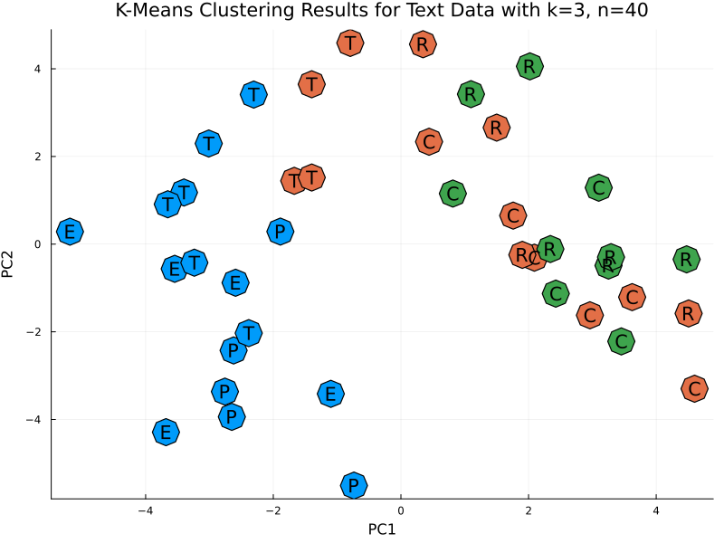

# [My Julia Practice](/README.md#julia)

Oh my Julia 정말 행복한 거니


### \<List>

- [Monte Carlo Simulation of Price Index Random Walks (2024.11.20)](#monte-carlo-simulation-of-price-index-random-walks-20241120)
- [Triple Pendulum Simulation (2024.09.23)](#triple-pendulum-simulation-20240923)
- [Double Pendulum Simulation (2024.09.22)](#double-pendulum-simulation-20240922)
- [K-Means Clustering for Text Data (2024.08.05)](#k-means-clustering-for-text-data-20240805)
- [Initial Practice (2024.05.28)](#initial-practice-20240528)


## [Monte Carlo Simulation of Price Index Random Walks (2024.11.20)](#list)

- Overview
  - Generation of simulated stock price data using log-normal distribution
  - Implementation of Monte Carlo simulation by creating multiple instances

  

- Code and Results : `RandomWalk.jl`
  <details>
    <summary>Load packages</summary>

  ```julia
  import Pkg

  # List of necessary packages
  packages = [
      "Distributions",
      "Plots"
  ]

  # Function to install a package if it's not already installed
  function install_if_needed(pkg::String)
      if !haskey(Pkg.project().dependencies, pkg)
          println("Installing package $(pkg)...")
          Pkg.add(pkg)
      end
  end

  # Install any missing packages from the list
  for pkg in packages
      install_if_needed(pkg)
  end

  @time using Distributions, Plots
  println("Packages loaded successfully.")
  ```
  </details>
  <details>
    <summary>Set constants and generate multiple random walks</summary>

  ```julia
  # Set simulation parameters
  n_steps = 1000       # Number of simulation steps
  n_simulations = 30   # Number of simulations
  initial_value = 100  # Initial price index
  μ = 0.0              # Mean of daily returns (log returns)
  σ = 0.03             # Standard deviation of daily returns (log returns)

  # Function to simulate price index random walks
  function generate_random_walk(n_steps, initial_value, μ, σ)
      returns = rand(Normal(μ, σ), n_steps)
      price_changes = exp.(cumsum(returns))
      return initial_value * price_changes
  end

  # Generate multiple random walks
  all_prices = [generate_random_walk(n_steps, initial_value, μ, σ) for _ in 1:n_simulations]
  ```
  </details>
  <details>
    <summary>Plot and save</summary>

  ```julia
  # Create the chart
  p = plot(title="Monte Carlo Simulation of Price Index Random Walks",
          xlabel="Time Step",
          ylabel="Price Index",
          legend=false,
          titlefont=font(16))

  # Plot each random walk
  for prices in all_prices
      plot!(p, 1:n_steps, prices, alpha=0.5, linewidth=1.5)
  end

  # Add a horizontal line for the initial price index
  hline!([initial_value], color=:red, linestyle=:dash, label="Initial Index", linewidth=2)

  # Customize the appearance
  plot!(p, size=(800, 600))
  plot!(p, ylims=(0, maximum([maximum(prices) for prices in all_prices]) * 1.1))

  # Save the chart
  file_name = "random_walk.png"
  savefig(p, "./Images/$(file_name)")
  println("Chart saved as $(file_name).")
  ```
  </details>


## [Triple Pendulum Simulation (2024.09.23)](#list)

- Upgraded version from [Double Pendulum Simulation (2024.09.22)](#double-pendulum-simulation-20240922)
  - The code structure remains largely the same, but the mathematical complexity has increased due to the addition of one more pendulum
  - Created with thoughts of my wife. Of course, the three red pendulums symbolize her lovely eyes, nose, and mouth. You nahm sayin?

  

- Code and Results : `TriplePendulum.jl`
  <details>
    <summary>0. Load packages</summary>

  ```julia
  using Pkg

  # List of necessary packages
  packages = [
      "Plots",               # For plotting the pendulum and animation
      "DifferentialEquations",# To solve the differential equations of motion
      "StaticArrays"          # For efficient small array operations
  ]

  # Function to install a package if it's not already installed
  function install_if_needed(pkg::String)
      if !haskey(Pkg.project().dependencies, pkg)
          println("Installing package $pkg...")
          Pkg.add(pkg)
      end
  end

  # Install any missing packages from the list
  for pkg in packages
      install_if_needed(pkg)
  end

  @time using Plots, DifferentialEquations, StaticArrays
  println("Packages loaded successfully.")
  ```
  </details>
  <details>
    <summary>1. Set constants and prepare mathematical works</summary>

  ```julia
  # Physical constants for the triple pendulum system
  g = 9.81   # Gravitational acceleration (m/s^2)
  L1, L2, L3 = 1.0, 1.0, 1.0   # Lengths of the rods (meters)
  m1, m2, m3 = 0.8, 1.0, 1.2   # Masses of the bobs (kg)

  # Equations of motion for the triple pendulum system
  function triple_pendulum!(du, u, p, t)
      θ1, θ2, θ3, ω1, ω2, ω3 = u   # Unpack current state variables
      Δθ12 = θ2 - θ1               # Angle difference between pendulums 1 and 2
      Δθ23 = θ3 - θ2               # Angle difference between pendulums 2 and 3

      # Denominators in the equations of motion, ensuring no division by zero
      denominator1 = (m1 + m2 + m3) * L1 - m2 * L1 * cos(Δθ12)^2 - m3 * L1 * cos(Δθ12)^2
      denominator2 = (m2 + m3) * L2 - m3 * L2 * cos(Δθ23)^2
      denominator3 = m3 * L3

      # First three components: angular velocities
      du[1] = ω1
      du[2] = ω2
      du[3] = ω3

      # Next three components: angular accelerations based on the equations of motion
      du[4] = (-g * (m1 + m2 + m3) * sin(θ1) - m2 * L2 * ω2^2 * sin(Δθ12) - m3 * L2 * ω2^2 * sin(Δθ12)) / denominator1
      du[5] = (-g * (m2 + m3) * sin(θ2) - m3 * L3 * ω3^2 * sin(Δθ23)) / denominator2
      du[6] = (-g * m3 * sin(θ3)) / denominator3
  end

  # Initial conditions: [θ1, θ2, θ3, ω1, ω2, ω3]
  # Pendulum angles are π/4 radians, and angular velocities are 0.
  u0 = [π/4, π/4, π/4, 0.0, 0.0, 0.0]

  # Time span for the simulation (0 to 40 seconds)
  tspan = (0.0, 40.0)

  # Define the ODE problem using the triple_pendulum! function
  prob = ODEProblem(triple_pendulum!, u0, tspan)

  # Solve the ODE with time step control, adjusting for small errors
  sol = solve(prob, Tsit5(), reltol=1e-8, abstol=1e-8, saveat=0.05)

  # Lists to store the trajectory of the third pendulum bob
  x3_traj = []
  y3_traj = []
  ```
  </details>
  <details>
    <summary>2. Animate and save</summary>

  ```julia
  # Frame rate for the animation
  fps = 30  # frames per second
  # Determine how many solution steps to skip to achieve desired fps
  frame_skip = max(Int(floor(length(sol.t) / (fps * (tspan[2] - tspan[1])))), 1)

  println("Creating the animation...")

  # Measure the time taken to create the animation
  @time begin
      anim = @animate for i in 1:frame_skip:length(sol.t)
          # Unpack the angles at the i-th time step
          θ1 = sol[i][1]
          θ2 = sol[i][2]
          θ3 = sol[i][3]

          # Calculate the positions of the pendulum bobs
          x1 = L1 * sin(θ1)
          y1 = -L1 * cos(θ1)
          x2 = x1 + L2 * sin(θ2)
          y2 = y1 - L2 * cos(θ2)
          x3 = x2 + L3 * sin(θ3)
          y3 = y2 - L3 * cos(θ3)

          # Save the position of the third pendulum bob for plotting its trajectory
          push!(x3_traj, x3)
          push!(y3_traj, y3)

          # Plot the pendulum configuration
          plot(legend=false, aspect_ratio=:equal, xlims=(-3.2, 3.2), ylims=(-3.2, 2.2), grid=false, framestyle=:none)
          plot!([0, x1, x2, x3], [0, y1, y2, y3], linewidth=2, label="")
          scatter!([x1, x2, x3], [y1, y2, y3], markercolor=:red, markersize=12)
          scatter!([0], [0], markercolor=:blue, markersize=15)

          # Plot the trajectory of the third pendulum bob
          plot!(x3_traj, y3_traj, linewidth=1, color=:grey)

          # Add title and adjust font size
          title!("Triple Pendulum like My Wife")
          plot!(titlefont = font(20))

          # Hide axis labels but keep the axes visible
          plot!(xlabel="", ylabel="", xticks=:none, yticks=:none)
      end
  end

  # Save the animation as a gif file
  filename = "triple_pendulum.gif"
  gif(anim, filename, fps=fps)
  ```
  </details>


## [Double Pendulum Simulation (2024.09.22)](#list)

- I did not fully understand the mathematical content, but I found the code created by ChatGPT helpful.
- The package loading and animation generation time took quite a long time

  

- Reference : [Double pendulum (Wikipedia)](https://en.wikipedia.org/wiki/Double_pendulum)
- Code and Results : `DoublePendulum.jl`
  <details>
    <summary>0. Load packages</summary>

  ```julia
  using Pkg

  # List of packages to check and install
  packages = [
      "Plots",
      "DifferentialEquations",
      "StaticArrays"
  ]

  # Function to install packages if they are not already installed
  function install_if_needed(pkg::String)
      if !haskey(Pkg.project().dependencies, pkg)
          println("Installing package: $pkg...")
          Pkg.add(pkg)
      end
  end

  # Install missing packages
  for pkg in packages
      install_if_needed(pkg)
  end

  @time using Plots, DifferentialEquations, StaticArrays
  println("Packages loaded successfully.")
  ```
  </details>
  <details>
    <summary>1. Set constants and prepare mathematical works</summary>

  ```julia
  # Physical constants
  g = 9.81    # Acceleration due to gravity (m/s^2)
  L1 = 1.0    # Length of the first rod (m)
  L2 = 1.0    # Length of the second rod (m)
  m1 = 1.0    # Mass of the first pendulum bob (kg)
  m2 = 1.0    # Mass of the second pendulum bob (kg)

  # Equations of motion for the double pendulum
  function double_pendulum!(du, u, p, t)
      θ1, θ2, ω1, ω2 = u
      Δθ = θ2 - θ1
      denominator1 = (m1 + m2) * L1 - m2 * L1 * cos(Δθ)^2
      denominator2 = (L2 / L1) * denominator1

      du[1] = ω1
      du[2] = ω2
      du[3] = (m2 * L1 * ω1^2 * sin(Δθ) * cos(Δθ) + m2 * g * sin(θ2) * cos(Δθ) + 
                m2 * L2 * ω2^2 * sin(Δθ) - (m1 + m2) * g * sin(θ1)) / denominator1
      du[4] = (-m2 * L2 * ω2^2 * sin(Δθ) * cos(Δθ) + (m1 + m2) * (g * sin(θ1) * cos(Δθ) - 
                L1 * ω1^2 * sin(Δθ) - g * sin(θ2))) / denominator2
  end

  # Initial conditions: [θ1, θ2, ω1, ω2] (angles in radians, angular velocities)
  u0 = [π/2, π/4, 0.0, 0.0]

  # Time span for simulation (extended time)
  tspan = (0.0, 40.0)  # Increased duration

  # Define the problem
  prob = ODEProblem(double_pendulum!, u0, tspan)

  # Solve the problem with time step control
  sol = solve(prob, Tsit5(), reltol=1e-8, abstol=1e-8, saveat=0.05)

  # Store the trajectory of the second pendulum bob
  x2_traj = []
  y2_traj = []
  ```
  </details>
  <details>
    <summary>2. Animate and save</summary>

  ```julia
  # Create an animation
  fps = 30  # Frames per second
  frame_skip = max(Int(floor(length(sol.t) / (fps * (tspan[2] - tspan[1])))), 1)

  println("Creating animation...")

  # Measure the time taken to create the animation
  @time begin
      anim = @animate for i in 1:frame_skip:length(sol.t)
          θ1 = sol[i][1]
          θ2 = sol[i][2]

          # Coordinates of the pendulum bobs
          x1 = L1 * sin(θ1)
          y1 = -L1 * cos(θ1)
          x2 = x1 + L2 * sin(θ2)
          y2 = y1 - L2 * cos(θ2)

          # Save second pendulum's position
          push!(x2_traj, x2)
          push!(y2_traj, y2)

          # Plot the double pendulum with fixed range, no grid, and axis
          plot(legend=false, aspect_ratio=:equal, xlims=(-2.2, 2.2), ylims=(-2.2, 0.7), grid=false, framestyle=:none)
          plot!([0, x1, x2], [0, y1, y2], linewidth=2, label="")
          scatter!([x1, x2], [y1, y2], markercolor=:red, markersize=12)
          scatter!([0], [0], markercolor=:blue, markersize=15)

          # Plot the solid line trajectory of the second pendulum
          plot!(x2_traj, y2_traj, linewidth=1, color=:grey)

          # Title and axis customization
          title!("Double Pendulum")
          plot!(titlefont = font(20))  # Set title font size

          plot!(xlabel="", ylabel="", xticks=:none, yticks=:none)  # Hide axis labels but keep axes
      end
  end

  # Save the animation as a gif
  filename = "double_pendulum.gif"
  gif(anim, filename, fps=fps)
  ```
  </details>


## [K-Means Clustering for Text Data (2024.08.05)](#list)

- Overview

  

  - Perform PCA & K-Means Clustering on Text Data
    - Data(`texts.json`) : 40 English text samples of approximately 10 sentences each, covering topics such as politics, economics, culture, technology, and random subjects. The data is generated in JSON format through ChatGPT.
  - Outliers: Users can manually input outliers into the code if detected.
  - Clustering: Although clustering is an unsupervised learning method, the original text categories are displayed during visualization for comparison purposes.
  - Development Environment (Online) : Julia 1.6.3 on [Replit](https://replit.com/)
- Future Improvements
  - Add Performance Evaluation: Incorporate performance evaluation features for PCA and K-Means Clustering.
  - Evaluation Methods: Since evaluating unsupervised learning results with confusion matrices is challenging, explore methods to assess group homogeneity and other evaluation metrics.
- Code and Results : `KMeansClusteringForTextData.jl`
  <details>
    <summary>0. Load packages</summary>

  ```julia
  using Pkg

  # Check and install required packages if not already installed
  function install_if_needed(pkg::String)
      """
      Checks if a package is installed. If not, installs it.
      
      # Arguments
      - `pkg::String`: The name of the package to check and install.
      """
      if !haskey(Pkg.project().dependencies, pkg)
          println("Installing package $pkg...")
          Pkg.add(pkg)
      else
          println("Package $pkg is already installed.")
      end
  end

  # List of packages to check and install
  packages = [
      "JSON",
      "Random",
      "StatsBase",
      "Clustering",
      "Plots",
      "Distances",
      "LinearAlgebra",
      "Colors"
  ]

  # Install missing packages
  for pkg in packages
      install_if_needed(pkg)
  end

  using JSON
  using Random
  using StatsBase
  using Clustering
  using Plots
  using Distances
  using LinearAlgebra
  using Colors
  ```
  </details>
  <details>
    <summary>1. Extract data</summary>

  ```julia
  # Load texts from a JSON file
  function load_texts_from_json(file_path::String)
      """
      Loads text data from a JSON file.
      
      # Arguments
      - `file_path::String`: The path to the JSON file.
      
      # Returns
      - A list of text data from the JSON file.
      """
      data = JSON.parsefile(file_path)
      return data["texts"]
  end

  texts_data = load_texts_from_json("texts.json")
  println("Successfully loaded $(length(texts_data)) texts from the JSON file.")

  # Extract contents and categories from the text data
  indices = [item["index"] for item in texts_data]
  contents = [item["content"] for item in texts_data]
  categories = [item["category"] for item in texts_data]
  ```
  </details>
  <details>
    <summary>2. Filter user-defined outlier</summary>

  ```julia
  # Function to filter outliers
  function filter_outliers(X, indices_to_exclude)
      """
      Filters out specified outlier indices from the dataset.

      # Arguments
      - `X::Matrix{Float64}`: The dataset matrix.
      - `indices_to_exclude::Vector{Int}`: Indices of outliers to exclude.

      # Returns
      - A matrix with outliers filtered out.
      """
      return hcat([X[:, i] for i in 1:size(X, 2) if i ∉ indices_to_exclude]...)
  end

  # User-defined outlier indices (for further adjustments)
  user_outlier_indices = []

  # Filter contents and categories based on filtered_indices
  filtered_indices = vec(filter_outliers(reshape(indices, 1, length(indices)), user_outlier_indices))
  filtered_contents = [contents[i] for i in filtered_indices]
  filtered_categories = [categories[i] for i in filtered_indices]
  println("Filtered out $(length(user_outlier_indices)) user-defined outliers. Remaining data points: $(length(filtered_indices)).")
  ```
  </details>
  <details>
    <summary>3. Preprocessing : Tokenizing and vectorizing</summary>

  ```julia
  # Preprocess text by tokenizing and lowercasing
  function preprocess(text)
      """
      Preprocesses text by splitting into words and converting to lowercase.
      
      # Arguments
      - `text::String`: The text to preprocess.
      
      # Returns
      - A list of words from the preprocessed text.
      """
      words = split(lowercase(text), r"[^\w]+")
      filter!(word -> word != "", words)
      return words
  end

  # Create a corpus from the contents
  corpus = [preprocess(text) for text in filtered_contents]
  vocab = unique(reduce(vcat, corpus))
  println("Finished preprocessing texts.")

  # Convert text to vectors based on vocabulary
  function vectorize(text, vocab)
      """
      Converts a list of words to a vector based on the given vocabulary.

      # Arguments
      - `text::Vector{String}`: The list of words to vectorize.
      - `vocab::Vector{String}`: The vocabulary to use for vectorization.

      # Returns
      - A vector representing the frequency of each word in the vocabulary.
      """
      counts = countmap(text)
      return [get(counts, word, 0) for word in vocab]
  end

  # Vectorize all texts
  vectors = [vectorize(text, vocab) for text in corpus]
  X = hcat(vectors...)
  println("Finished vectorizing texts.")
  ```
  </details>
  <details>
    <summary>4. PCA</summary>

  ```julia
  # Perform PCA for dimensionality reduction
  function pca(X; k=2)
      """
      Applies Principal Component Analysis (PCA) for dimensionality reduction.

      # Arguments
      - `X::Matrix{Float64}`: The data matrix to reduce.
      - `k::Int`: The number of principal components to keep (default is 2).

      # Returns
      - A matrix with reduced dimensions based on PCA.
      """
      X_centered = X .- mean(X, dims=2)
      cov_matrix = X_centered * X_centered' / (size(X, 2) - 1)
      eigenvalues, eigenvectors = eigen(cov_matrix)
      sorted_indices = sortperm(eigenvalues, rev=true)
      top_indices = sorted_indices[1:k]
      return eigenvectors[:, top_indices]' * X_centered
  end

  # Perform PCA
  X_reduced = pca(X; k=2)
  println("Finished PCA.")
  ```
  </details>
  <details>
    <summary>5. Detect Outliers</summary>

  ```julia
  # Detect outliers from PCA results
  function detect_outliers_pca(X_reduced; iqr_multiplier=1.5)
      """
      Detects outliers based on the PCA results using IQR.

      # Arguments
      - `X_reduced::Matrix{Float64}`: The PCA-reduced data matrix.
      - `iqr_multiplier::Float64`: The multiplier for IQR to determine outliers.

      # Returns
      - Indices of the detected outliers.
      """
      n = size(X_reduced, 2)
      outlier_indices = Int[]

      for j in 1:size(X_reduced, 1)
          pc_values = X_reduced[j, :]
          q1 = quantile(pc_values, 0.25)
          q3 = quantile(pc_values, 0.75)
          iqr = q3 - q1
          lower_bound = q1 - iqr_multiplier * iqr
          upper_bound = q3 + iqr_multiplier * iqr
          outlier_indices_for_pc = findall(x -> x < lower_bound || x > upper_bound, pc_values)
          append!(outlier_indices, outlier_indices_for_pc)
      end

      return unique(outlier_indices)
  end

  # Function to print outlier texts
  function print_outlier_texts(texts, indices)
      """
      Prints the indices and truncated contents of texts that are considered outliers.

      # Arguments
      - `texts::Vector{String}`: The list of text contents.
      - `indices::Vector{Int}`: Indices of texts that are considered outliers.
      """
      if length(indices) > 0
          println("Detected outliers based on PCA:")
          for index in indices
              text = texts[index]
              truncated_text = length(text) > 50 ? text[1:50] * " ……" : text
              println("  Index $(filtered_indices[index]): $truncated_text")
          end
      else
          println("No outliers detected based on PCA.")
      end
  end

  # Detect outliers from PCA results
  outlier_indices = detect_outliers_pca(X_reduced)

  # Print detected outliers
  print_outlier_texts(filtered_contents, outlier_indices)
  ```
  </details>
  <details>
    <summary>6. K-means clustering</summary>

  ```julia
  # Perform K-means clustering
  function perform_kmeans(X, k; distance=Euclidean())
      """
      Performs K-means clustering on the data matrix.

      # Arguments
      - `X::Matrix{Float64}`: The data matrix to cluster.
      - `k::Int`: The number of clusters.
      - `distance::Function`: The distance function to use (default is Euclidean).

      # Returns
      - A Clustering.KMeans result.
      """
      return kmeans(X, k; distance=distance)
  end

  k = 3  # Set the desired number of clusters
  result = perform_kmeans(X, k)
  labels = result.assignments
  println("Finished K-means clustering with k=$k, n=$(length(filtered_indices)).")
  ```
  </details>
  <details>
    <summary>7. Plot & Save</summary>

  ```julia
  # Map categories to marker initials
  category_to_initial = Dict(
      "politics" => "P",
      "economics" => "E",
      "culture" => "C",
      "technology" => "T",
      "random" => "R"
  )
  marker_initials = [category_to_initial[category] for category in filtered_categories]

  # Plot clusters with category initials
  function save_clusters_plot(X_reduced, labels, marker_initials, k, filename="text_kmeans.png")
      """
      Saves a scatter plot of clustered data with category initials.

      # Arguments
      - `X_reduced::Matrix{Float64}`: The data matrix with reduced dimensions.
      - `labels::Vector{Int}`: Cluster labels for each data point.
      - `marker_initials::Vector{String}`: Initials representing categories.
      - `k::Int`: The number of clusters.
      - `filename::String`: The file name to save the plot (default is "text_kmeans.png").
      """
      p = scatter(X_reduced[1, :], X_reduced[2, :], group=labels, color=labels, 
                  legend=false, marker=:o, markersize=10,  # Adjust marker size here
                  title="K-Means Clustering Results for Text Data with k=$k, n=$(length(filtered_indices))",
                  xlabel="PC1", ylabel="PC2", size=(800, 600))

      # Add text annotations for category initials
      scatter!(X_reduced[1, :], X_reduced[2, :], marker=:o, markersize=15, color=labels)
      for i in 1:size(X_reduced, 2)
          annotate!(
              X_reduced[1, i],
              X_reduced[2, i],
              text(marker_initials[i])
          )
      end

      savefig(filename)
  end

  # Plot clusters with category initials
  save_clusters_plot(X_reduced, labels, marker_initials, k)
  println("Cluster plot saved to file.")
  ```
  </details>
  <details open="">
    <summary>8. Results</summary>

  ```txt
  Package JSON is already installed.
  Package Random is already installed.
  Package StatsBase is already installed.
  Package Clustering is already installed.
  Package Plots is already installed.
  Package Distances is already installed.
  Package LinearAlgebra is already installed.
  Package Colors is already installed.
  Successfully loaded 40 texts from the JSON file.
  Filtered out 0 user-defined outliers. Remaining data points: 40.
  Finished preprocessing texts.
  Finished vectorizing texts.
  Finished PCA.
  No outliers detected based on PCA.
  Finished K-means clustering with k=3, n=40.
  Cluster plot saved to file.
  ```
  </details>


## [Initial Practice (2024.05.28)](#list)

- Overview
  - Basic practice of Julia's various syntactical features and analytical capabilities
  - Development Environment (Online) : [COCALC](https://cocalc.com/)
  - References
    - [[책] 줄리아 프로그래밍 (류대식,전기현 / 비제이퍼블릭 / 2024)](https://search.shopping.naver.com/book/catalog/47287220619)
    - [[블로그] 생새우초밥집 > 줄리아](https://freshrimpsushi.github.io/ko/categories/줄리아/)
- Code and Results : `InitialPractice.jl`
  <details>
    <summary>1. Calculation</summary>

  ```julia
  println(1 + 20 + 4)
  println(+(1, 20, 4))
  println()

  x = 2
  println(2x)
  println()

  for i ∈ 0:0.2:2
      println("sin^2($i π) + cos^2($i π) = ", sin(i * π)^2 + cos(i * π)^2)
  end
  # What is the difference between sin() and sin.()?
  ```
  ```txt
  25
  25

  4

  sin^2(0.0 π) + cos^2(0.0 π) = 1.0

  sin^2(0.2 π) + cos^2(0.2 π) = 1.0
  sin^2(0.4 π) + cos^2(0.4 π) = 0.9999999999999999
  sin^2(0.6 π) + cos^2(0.6 π) = 1.0
  sin^2(0.8 π) + cos^2(0.8 π) = 1.0
  sin^2(1.0 π) + cos^2(1.0 π) = 1.0
  sin^2(1.2 π) + cos^2(1.2 π) = 0.9999999999999999
  sin^2(1.4 π) + cos^2(1.4 π) = 1.0
  sin^2(1.6 π) + cos^2(1.6 π) = 1.0
  sin^2(1.8 π) + cos^2(1.8 π) = 1.0000000000000002
  sin^2(2.0 π) + cos^2(2.0 π) = 1.0
  ```
  </details>
  <details>
    <summary>2. Macro : @time @threads</summary>

  ```julia
  using Base.Threads


  # 2.1 @time

  x = zeros(3)

  @time for i ∈ 1:10_000
      x += rand(3)
  end
  println()


  # 2.2 @threads

  Threads.nthreads() = 16                    # no physical multi-core
  println(Threads.nthreads())
  println()

  @time for i ∈ 1:20
      print(i, " ")
  end
  println()

  @time @threads for i ∈ 1:20
      print(i, " ")
  end
  println()
  ```
  ```txt
    0.107893 seconds (148.09 k allocations: 10.412 MiB, 99.20% compilation time)

  16

  1 2 3 4 5 6 7 8 9 10 11 12 13 14 15 16 17 18 19 20 
    0.000255 seconds (462 allocations: 11.062 KiB)

  1 2 3 4 5 6 7 8 9 10 11 12 13 14 15 16 17 18 19 20 
    0.182614 seconds (39.54 k allocations: 2.568 MiB, 95.79% compilation time)
  ```
  </details>
  <details>
    <summary>3. Merge strings</summary>

  ```julia
  println(join(["Hello", "World"], ""))
  println("Hello" * "World")
  ```
  ```txt
  HelloWorld
  HelloWorld
  ```
  </details>
  <details>
    <summary>4. K-means Clustering</summary>

  ```julia
  # https://freshrimpsushi.github.io/ko/posts/3572/

  using RDatasets, Clustering, Plots

  # RDatasets.datasets()                                     # list datasets in RDatasets
  data = dataset("datasets", "iris")[:, 1:4]
  data = Array(data)'

  results = kmeans(data, 3, display=:iter)
  println()
  println(results.centers)
  println()
  println(results.counts)
  println()

  names = ["sepallength", "sepalwidth"]                      # hope to call them from the dataset but ……
  markers = [:circle, :utriangle, :xcross]

  p = plot(dpi = 300, legend = :none)
  for i in 1:3
      i_cluster = findall(x -> x == i, results.assignments)
      scatter!(
          p, data[1, i_cluster], data[2, i_cluster],
          marker = markers[i],
          ms = 6,
          xlabel = names[1],
          ylabel = names[2]
      )
  end
  display(p)

  png(p, "Images/iris_kmeans.png")
  ```
  ```txt
    Iters               objv        objv-change | affected 
  -------------------------------------------------------------
        0       1.577500e+02
        1       9.988221e+01      -5.786779e+01 |        2
        2       8.774180e+01      -1.214041e+01 |        2
        3       8.495218e+01      -2.789621e+00 |        2
        4       8.401278e+01      -9.394005e-01 |        2
        5       8.304698e+01      -9.657970e-01 |        2
        6       8.174960e+01      -1.297380e+00 |        2
        7       8.080638e+01      -9.432261e-01 |        2
        8       7.987358e+01      -9.327962e-01 |        2
        9       7.934436e+01      -5.292157e-01 |        2
       10       7.892131e+01      -4.230544e-01 |        2
       11       7.885567e+01      -6.564390e-02 |        0
       12       7.885567e+01       0.000000e+00 |        0
  K-means converged with 12 iterations (objv = 78.85566582597659)

  [6.853846153846153 5.005999999999999 5.88360655737705; 3.0769230769230766 3.428000000000001 2.740983606557377; 5.715384615384615 1.4620000000000002 4.388524590163935; 2.053846153846153 0.2459999999999999 1.4344262295081966]

  [39, 50, 61]
  ```
  
  </details>
  <details>
    <summary>5. Regression</summary>

  ```julia
  # https://freshrimpsushi.github.io/ko/posts/2493/#fn:1

  using GLM, RDatasets

  faithful = dataset("datasets", "faithful")

  out1 = lm(@formula(Waiting ~ Eruptions), faithful)
  ```
  ```txt
  StatsModels.TableRegressionModel{LinearModel{GLM.LmResp{Vector{Float64}}, GLM.DensePredChol{Float64, LinearAlgebra.CholeskyPivoted{Float64, Matrix{Float64}, Vector{Int64}}}}, Matrix{Float64}}

  Waiting ~ 1 + Eruptions

  Coefficients:
  ───────────────────────────────────────────────────────────────────────
                Coef.  Std. Error      t  Pr(>|t|)  Lower 95%  Upper 95%
  ───────────────────────────────────────────────────────────────────────
  (Intercept)  33.4744    1.15487   28.99    <1e-84    31.2007    35.7481
  Eruptions    10.7296    0.314753  34.09    <1e-99    10.11      11.3493
  ───────────────────────────────────────────────────────────────────────
  ```
  </details>
  <details>
    <summary>6. Animated Plotting</summary>

  ```julia
  # https://freshrimpsushi.github.io/ko/posts/3556/

  using Plots

  θ = range(0, 2π, length=100)
  x = sin.(2θ * 2)
  y = cos.(2θ * 2)
  z = θ

  anim = @animate for i ∈ 0:3:360
      plot(x, y, z, xlabel="x", ylabel="y", zlabel="z", camera=(i,30), title="azimuth = $i")
  end
  gif(anim, "Images/helix.gif", fps=50)
  ```
  ```txt
  [ Info: Saved animation to /home/user/helix.gif
  ```
  
  </details>
