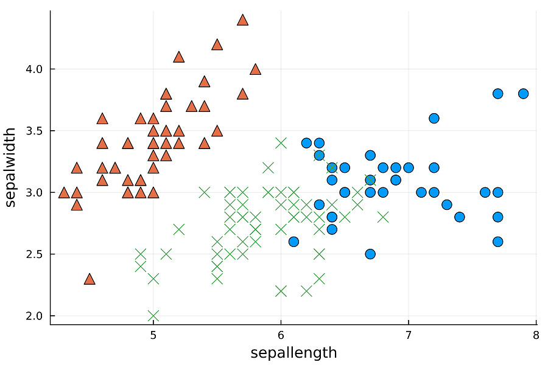
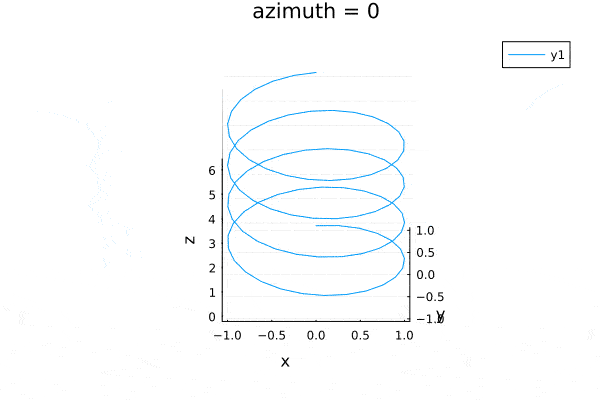

# [My Julia Practice](/README.md#julia)

Oh my Julia 정말 행복한 거니


### \<List>

- [Initial Practice (2024.05.28)](#initial-practice-20240528)


## [Initial Practice (2024.05.28)](#list)

- References
  - [[책] 줄리아 프로그래밍 (류대식,전기현 / 비제이퍼블릭 / 2024)](https://search.shopping.naver.com/book/catalog/47287220619)
  - [[블로그] 생새우초밥집 > 줄리아](https://freshrimpsushi.github.io/ko/categories/줄리아/)

- Code and Results : `InitialPractice.jl`
  <details>
    <summary>1. Calculation</summary>

  ```julia
  println(1 + 20 + 4)
  println(+(1, 20, 4))
  println()

  x = 2
  println(2x)
  println()

  for i ∈ 0:0.2:2
      println("sin^2($i π) + cos^2($i π) = ", sin(i * π)^2 + cos(i * π)^2)
  end
  # What is the difference between sin() and sin.()?
  ```
  ```txt
  25
  25

  4

  sin^2(0.0 π) + cos^2(0.0 π) = 1.0

  sin^2(0.2 π) + cos^2(0.2 π) = 1.0
  sin^2(0.4 π) + cos^2(0.4 π) = 0.9999999999999999
  sin^2(0.6 π) + cos^2(0.6 π) = 1.0
  sin^2(0.8 π) + cos^2(0.8 π) = 1.0
  sin^2(1.0 π) + cos^2(1.0 π) = 1.0
  sin^2(1.2 π) + cos^2(1.2 π) = 0.9999999999999999
  sin^2(1.4 π) + cos^2(1.4 π) = 1.0
  sin^2(1.6 π) + cos^2(1.6 π) = 1.0
  sin^2(1.8 π) + cos^2(1.8 π) = 1.0000000000000002
  sin^2(2.0 π) + cos^2(2.0 π) = 1.0
  ```
  </details>
  <details>
    <summary>2. Macro : @time @threads</summary>

  ```julia
  using Base.Threads


  # 2.1 @time

  x = zeros(3)

  @time for i ∈ 1:10_000
      x += rand(3)
  end
  println()


  # 2.2 @threads

  Threads.nthreads() = 16                    # no physical multi-core
  println(Threads.nthreads())
  println()

  @time for i ∈ 1:20
      print(i, " ")
  end
  println()

  @time @threads for i ∈ 1:20
      print(i, " ")
  end
  println()
  ```
  ```txt
    0.107893 seconds (148.09 k allocations: 10.412 MiB, 99.20% compilation time)

  16

  1 2 3 4 5 6 7 8 9 10 11 12 13 14 15 16 17 18 19 20 
    0.000255 seconds (462 allocations: 11.062 KiB)

  1 2 3 4 5 6 7 8 9 10 11 12 13 14 15 16 17 18 19 20 
    0.182614 seconds (39.54 k allocations: 2.568 MiB, 95.79% compilation time)
  ```
  </details>
  <details>
    <summary>3. Merge strings</summary>

  ```julia
  println(join(["Hello", "World"], ""))
  println("Hello" * "World")
  ```
  ```txt
  HelloWorld
  HelloWorld
  ```
  </details>
  <details>
    <summary>4. K-means Clustering</summary>

  ```julia
  # https://freshrimpsushi.github.io/ko/posts/3572/

  using RDatasets, Clustering, Plots

  # RDatasets.datasets()                                     # list datasets in RDatasets
  data = dataset("datasets", "iris")[:, 1:4]
  data = Array(data)'

  results = kmeans(data, 3, display=:iter)
  println()
  println(results.centers)
  println()
  println(results.counts)
  println()

  names = ["sepallength", "sepalwidth"]                      # hope to call them from the dataset but ……
  markers = [:circle, :utriangle, :xcross]

  p = plot(dpi = 300, legend = :none)
  for i in 1:3
      i_cluster = findall(x -> x == i, results.assignments)
      scatter!(
          p, data[1, i_cluster], data[2, i_cluster],
          marker = markers[i],
          ms = 6,
          xlabel = names[1],
          ylabel = names[2]
      )
  end
  display(p)

  png(p, "Images/iris_kmeans.png")
  ```
  ```txt
    Iters               objv        objv-change | affected 
  -------------------------------------------------------------
        0       1.577500e+02
        1       9.988221e+01      -5.786779e+01 |        2
        2       8.774180e+01      -1.214041e+01 |        2
        3       8.495218e+01      -2.789621e+00 |        2
        4       8.401278e+01      -9.394005e-01 |        2
        5       8.304698e+01      -9.657970e-01 |        2
        6       8.174960e+01      -1.297380e+00 |        2
        7       8.080638e+01      -9.432261e-01 |        2
        8       7.987358e+01      -9.327962e-01 |        2
        9       7.934436e+01      -5.292157e-01 |        2
      10       7.892131e+01      -4.230544e-01 |        2
      11       7.885567e+01      -6.564390e-02 |        0
      12       7.885567e+01       0.000000e+00 |        0
  K-means converged with 12 iterations (objv = 78.85566582597659)

  [6.853846153846153 5.005999999999999 5.88360655737705; 3.0769230769230766 3.428000000000001 2.740983606557377; 5.715384615384615 1.4620000000000002 4.388524590163935; 2.053846153846153 0.2459999999999999 1.4344262295081966]

  [39, 50, 61]
  ```
  
  </details>
  <details>
    <summary>5. Regression</summary>

  ```julia
  # https://freshrimpsushi.github.io/ko/posts/2493/#fn:1

  using GLM, RDatasets

  faithful = dataset("datasets", "faithful")

  out1 = lm(@formula(Waiting ~ Eruptions), faithful)
  ```
  ```txt
  StatsModels.TableRegressionModel{LinearModel{GLM.LmResp{Vector{Float64}}, GLM.DensePredChol{Float64, LinearAlgebra.CholeskyPivoted{Float64, Matrix{Float64}, Vector{Int64}}}}, Matrix{Float64}}

  Waiting ~ 1 + Eruptions

  Coefficients:
  ───────────────────────────────────────────────────────────────────────
                Coef.  Std. Error      t  Pr(>|t|)  Lower 95%  Upper 95%
  ───────────────────────────────────────────────────────────────────────
  (Intercept)  33.4744    1.15487   28.99    <1e-84    31.2007    35.7481
  Eruptions    10.7296    0.314753  34.09    <1e-99    10.11      11.3493
  ───────────────────────────────────────────────────────────────────────
  ```
  </details>
  <details>
    <summary>6. Animated Plotting</summary>

  ```julia
  # https://freshrimpsushi.github.io/ko/posts/3556/

  using Plots

  θ = range(0, 2π, length=100)
  x = sin.(2θ * 2)
  y = cos.(2θ * 2)
  z = θ

  anim = @animate for i ∈ 0:3:360
      plot(x, y, z, xlabel="x", ylabel="y", zlabel="z", camera=(i,30), title="azimuth = $i")
  end
  gif(anim, "Images/helix.gif", fps=50)
  ```
  ```txt
  [ Info: Saved animation to /home/user/helix.gif
  ```
  
  </details>