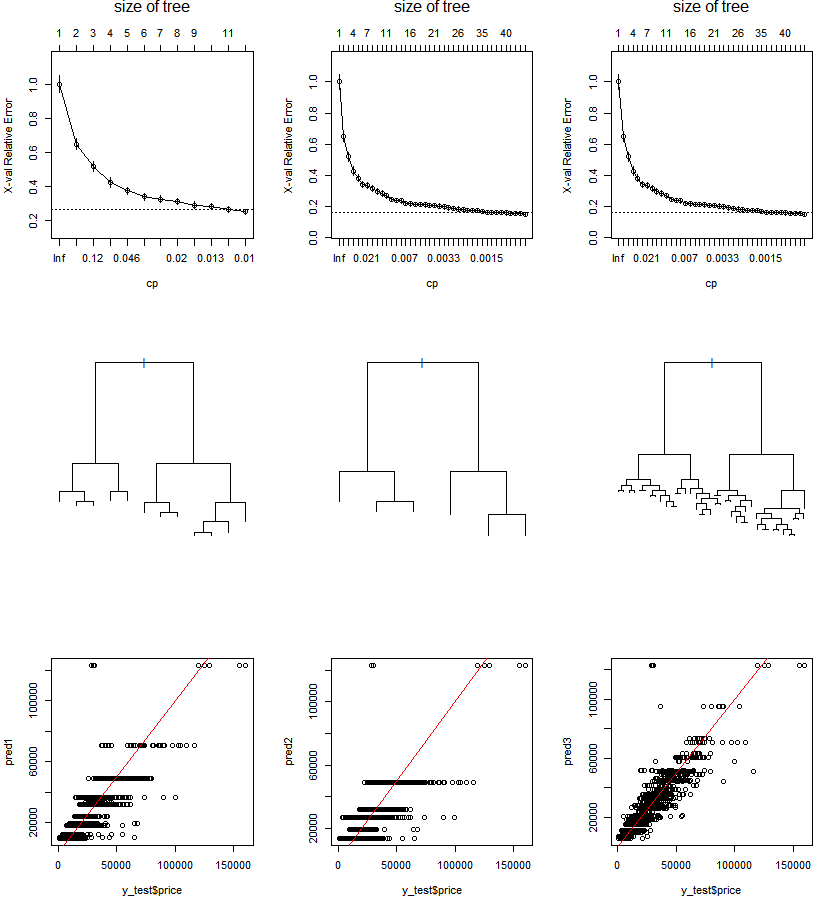

## Kaggle > Dataset

# used car price dataset (competition format)

https://www.kaggle.com/datasets/kukuroo3/used-car-price-dataset-competition-format

## [Decision Tree Regression with *Used Car Prices* in R (2022.12.07)](#kaggle--dataset)

- [Kaggle Notebook : DT(`rpart`) Practice with *Used Car Prices* in R](https://www.kaggle.com/code/kangrokkim/dt-rpart-practice-with-used-car-prices-in-r/)

- Pre-processing
  - The given data has been already divided into Train/Test data and there's no missing data(:heart_eyes:)
  - Remove 3 variables : `carID` `brand` `model`

- Model fitting : Use `rpart` library in R and try Decision Tree Regression
  - At the 1st trial, there's no point for `xerror` to rise up again, but I feel I should do something …… (:scream:)
  - But at the 2nd trial, it shows rather worse performance. (:sob:)

- Compare 3 models with different **CP(Complexity Parameter)** values
  | models | cp | nsplit | min_xerror | correlation | rmse |
  |:-:| :-: |--:|--:|--:|--:|
  | 1 | 0.010 (default) | 10 | 0.2629 | 0.8432 | 8951 |
  | 2 | 0.025 | 5 | 0.3538 | 0.7950 | 10093 |
  | 3 | 0.001 | 45 | 0.1484 | 0.9021 | 7230 |

  

- Takeaway
  - the result from `rpart()` is not a regression formula, but it just outputs some "countable" kinds of values. If I knew it, I wouldn't try cutting cp hastly.